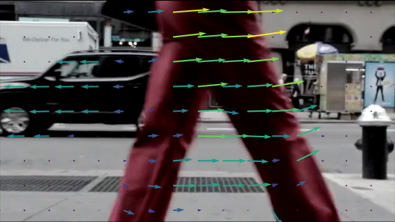
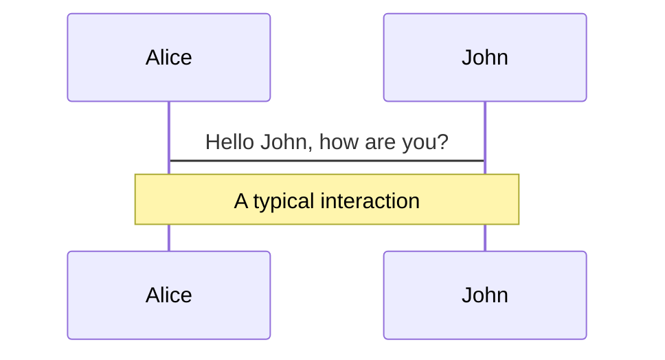
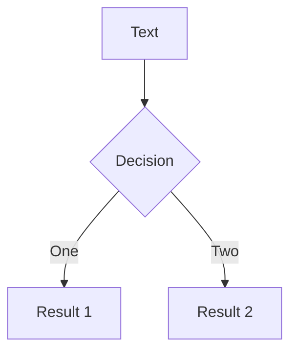
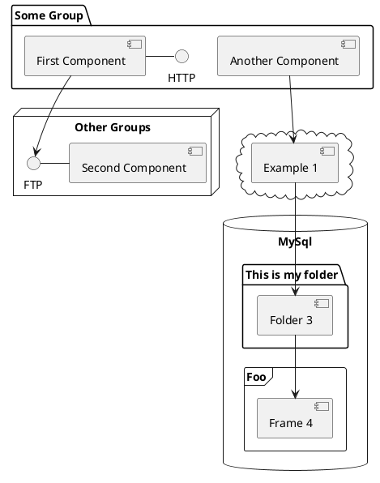

<!-- TODO@mateosss: what's the info field? -->

### *Localización visual-inercial en tiempo real para aplicaciones de XR*

<br>

*Trabajo especial de Licenciatura en Ciencias de la Computación*

| **Autor**  |  Mateo de Mayo |
|---:|:---|
| **Director**  |  Dr. Nicolás Wolovick |
| **Trabajo Completo**  |  [bit.ly/tesis-xr](https://bit.ly/tesis-xr) |

<div width="100%" style="bottom: 0">


<i>Facultad de Matemática, Astronomía, Física y Computación</i>
<br>
<i>Universidad Nacional de Córdoba</i>
</div>

<style>
  table {
    margin-bottom: 4rem;
  }

  h3 {
    margin-top: 2rem;
    color: var(--slidev-theme-primary) !important;
  }

</style>

<!--
1. Me presento
2. Qué es esta presentación?
3. Presento al tribunal
-->

---
layout: cover
background: none
---
# Demostración 1

Cámara Intel RealSense D455


<style>
  img {
    width: 60%;
    margin: auto;
    margin-top: 5rem;
  }
</style>

---
layout: cover
background: none
---
# Introducción

Entendiendo el nombre de este trabajo.

---

# XR - Realidad extendida

<center><h3>Localización visual-inercial en tiempo real para aplicaciones de <u>XR</u></h3></center>


<div grid="~ cols-2 gap-2" m="-t-2">
<v-click></v-click>
<v-after></v-after>
</div>

---

# The Khronos Group

<center><h3>Localización visual-inercial en tiempo real para <u>aplicaciones</u> de XR</h3></center>

<br>

<br>


<!--
Consorcio de industria sin fines de lucro.
-->
---

# OpenXR

<center><h3>Localización visual-inercial en tiempo real para <u>aplicaciones</u> de XR</h3></center>

<br>
<br>


<!--
Gran adopción (~170 y principales fabricantes)
-->

---

# Monado y Collabora

<center><h3>Localización visual-inercial en tiempo real para <u>aplicaciones</u> de XR</h3></center>

<br>
<br>


<!--
- Consultora open source
- Pasantía de 6 meses
- Integrar soluciones de la academia
-->

---


# Localización - Tracking

<center><h3><u>Localización</u> visual-inercial en tiempo real para aplicaciones de XR</h3></center>

<br>
<br>

<div grid="~ cols-3 gap-2" m="-t-2">


</div>

<!--
- Optitrack grande 360k USD, chico 10k, una 700 (USD)
- 1 lighhouse 100usd
-->

---

# Visual-inercial - Sensores

<center><h3>Localización <u>visual-inercial</u> en tiempo real para aplicaciones de XR</h3></center>

<br>
<br>
<br>

<div grid="~ cols-3 gap-2" m="-t-2">


</div>

<br>
<br>
<br>

<v-clicks>

- **IMU**: muestras ruidosas propioceptivas con acelerómetro y giroscopio (cf.
  sistema vestibular).
- **Cámaras estéreo**: muestras de referencias exteroceptivas (cf. sistema visual).
- **Sistemas académicos** - SLAM, VIO, SfM.

</v-clicks>

<!--
- sistema vestibular: utrículo y sáculo
- fusion de sensores inteligente
- áreas: CV, optimizacion, probabilidad, filtrado de señales,
-->

---
layout: cover
background: none
---
# Ideas Teóricas

Dos ideas fundamentales: transformaciones y optimización.

---

# Ideas Teóricas

En este trabajo decidimos enfocarnos en dos.

<v-clicks>

- **Transformaciones** - Formalizaciones que nos permiten representar y manipular relaciones espaciales.

- **Cuadrados Mínimos** - Método central de optimización (convexa).

</v-clicks>

---

# Transformaciones

Intuición del concepto.


<v-clicks>

- Traslaciones y rotaciones.
- Posición y orientación.

</v-clicks>

---

# Transformaciones

*Definición:* un grupo es un conjunto $G$ con una operación binaria $\circ : G
\times G \rightarrow G$ tal que $\forall a, b, c \in G$:

<v-clicks>

1. Es cerrada: $a \circ b \in G$
2. Es asociativa: $(a \circ b) \circ c = a \circ (b \circ c)$
3. Tiene neutro: $\exists!\ e \in G: e \circ a = a \circ e = a$
4. Tiene inverso: $\exists a^{-1} \in G: a \circ a^{-1} = a^{-1} \circ a = e$

</v-clicks>

<v-click>

*Esta idea encaja con nuestra intuición de traslaciones, rotaciones y transformaciones.*

</v-click>

<!-- TODO@mateosss: imagen de cubo de rubik -->

---

# Transformaciones

En la práctica usamos las siguientes representaciones.

- **Traslaciones** - Vectores en $\R^n$ (caso $n = 2$ es válido y lo usamos)
- **Rotaciones** - Ángulos Euler, ángulo-axial, cuaterniones, matrices de
  rotación $SO(n)$.
- **Transformaciones** - Matriz homogénea $SE(n)$.
- **Infinitesimales** - Grupos y álgebras de Lie: $SE(n)$, $\mathfrak{se(n)}$, $SO(n)$, $\mathfrak{so(n)}$.

<!-- TODO@mateosss: imagenes que ayuden a entender mejor las representaciones

Grupos y algebras de Lie no son triviales, pero usarlas es mas sencillo y hay algunas demostraciones que ayudan a entenderlo en el escrito.
- Manifold/variedad: al hacer zoom se parece a R^n
- Smooth manifold: no hay partes bruscas
- Grupo de Lie: smooth manifold en donde la operacion del grupo es diferenciable
- Álgebra de Lie: espacio R^n de las posibles "velocidades" sobre la identidad del grupo
-->

---

# Cuadrados Mínimos

Cómo fusionar la información de los distintos tipos de muestras?

<v-clicks>

- En la literatura clásica: filtros Kalman.
- Recientemente: optimización por cuadrados mínimos.
- Un sistema tiene usualmente varios aspectos en los que se puede aplicar optimización:
  - Calibración de los sensores.
  - Reproyección de puntos en la escena (cuando no existe expresión cerrada).
  - Bundle adjustment.
  - Flujo óptico.
  - Alineamiento de trayectorias para métricas.

</v-clicks>

---

# Cuadrados Mínimos - Planteo

Encontrar $\hat{x}$ tal que $E(\hat{x})$ sea mínimo.

$m$ restricciones, estimación $x \in \R^n$, residuales $r_i : \R^n \rightarrow \R$.

$$
E(x) = \sum_{i=1}^m{r_i(x) ^ 2} = \| r(x) \| ^ 2
$$

<v-click>

#### Caso Lineal - $Ax \sim b$

$$
E(x) = \sum_{i=1}^m{(Ax - b)_i^2} = \| Ax - b \| ^ 2
$$

</v-click>

<v-click>

#### Caso no lineal - $f(x) \sim 0$

$$
E(x) = \sum_{i=1}^m{f_i(x)^2} = \| f(x) \| ^ 2
$$

</v-click>

<v-click>

*Correspondencia con estimadores MAP (cf. de máxima verosimilitud)*.

</v-click>

---

# Cuadrados Mínimos - Soluciones

#### Caso Lineal - $Ax \sim b$ - Solución directa.

$$
\begin{align}
\hat{x} &= A^{\dagger} b \nonumber \\
\text{con} \  A^{\dagger} &= (A^T A)^{-1} A^T \nonumber
\end{align}
$$

<v-click>

#### Caso no lineal - $f(x) \sim 0$ - Solución iterativa.

**Dado** $x^{(0)}$ inicial suficientemente cercano a la solución.

1. **Linealizar**. Dado $A_k$ el jacobiano de $f$ alrededor de $x^{(k)}$:

$$
f^{(k)}(x) = f(x^{(k)}) + A_k (x - x^{(k)})
$$

1. **Actualizar**. Resolviendo con la solución para el caso lineal.
$$
x^{(k+1)} = x^{(k)} - A_k^{\dagger} f(x^{(k)})
$$

</v-click>


<v-click>

*Esto es el algoritmo de Gauss-Newton, existen otros: Levenberg-Marquardt, método dogleg de Powell.*

</v-click>

---
layout: cover
background: none
---
# Sistemas Integrados

Y las problemáticas de lidiar con software desarrollado en la academia.

---

# Sistemas

<v-clicks>

1. Muchos sistemas con objetivos varios. Publicaciones con métodos poco claros, bias en las métricas.
2. Sistemas integrados (~25kloc):
    1. **Kimera-VIO**: del MIT, licencia BSD-2 (~200ms).
    2. **ORB-SLAM3**: de la Unizar, licencia GPL-3, supuesto estado del arte (~40ms).
    3. **Basalt**: de la TUM, licencia BSD-3 (~10ms).
3. Basalt el más adecuado para XR.

</v-clicks>

---

# Basalt - Preintegración de muestras de la IMU

Frecuencias y ecuaciones de mecanización.


$$
\begin{align}
(\Delta \mathbf{R}_{t_i}, \Delta \mathbf{v}_{t_i}, \Delta
\mathbf{p}_{t_i}) := (\mathbf{I}, \mathbf{0}, \mathbf{0})
\\
\Delta \mathbf{R}_{t+1} := \Delta \mathbf{R}_t exp(\mathbf{\omega}_{t+1} \Delta t)\\
\Delta \mathbf{v}_{t+1} := \Delta \mathbf{v}_t + \Delta{\mathbf{R}_t}
\mathbf{a}_{t+1} \Delta t
\\
\Delta \mathbf{p}_{t+1} := \Delta \mathbf{p}_t + \Delta \mathbf{v}_t \Delta t
\\
\Delta \mathbf{s}_{t} := (\Delta \mathbf{R}_{t}, \Delta \mathbf{v}_{t}, \Delta
\mathbf{p}_{t})
\\
\Delta \mathbf{s} := \Delta \mathbf{s}_{t_j}
\end{align}
$$

---

# Basalt - Detección de features

Detección de características de la escena con `cv::FAST`.

<br>
<br>
<br>
<br>
<br>

<div grid="~ cols-1 gap-2" m="-t-2">

</div>

---

# Basalt - Flujo óptico

Optical flow con el Lukas-Kanade tracker y optimización para encontrar $T \in
SE(2)$ con residuales:

$$
r_i =
  \frac{I_{t + 1}(\mathbf{T} \mathbf{x}_i)}{\overline{I_{t + 1}}} -
  \frac{I_{t}(\mathbf{x}_i)}{\overline{I_{t}}}
  \ \ \ \ \forall \mathbf{x}_i \in \Omega
$$

<div grid="~ cols-1 gap-2" m="-t-2">

</div>
---

# Basalt - Flujo óptico

Optical flow con el Lukas-Kanade tracker y optimización para encontrar $T \in
SE(2)$ con residuales:

$$
r_i =
  \frac{I_{t + 1}(\mathbf{T} \mathbf{x}_i)}{\overline{I_{t + 1}}} -
  \frac{I_{t}(\mathbf{x}_i)}{\overline{I_{t}}}
  \ \ \ \ \forall \mathbf{x}_i \in \Omega
$$

<div grid="~ cols-1 gap-2" m="-t-2">

</div>

---

# Basalt - Triangulación de landmarks


---

# Basalt - Bundle Adjustment

Grafo de factores implícito en Basalt, explícito en otros sistemas con `g2o` o `GTSAM`.


<!-- Aquí ocurre la optimización por gauss newton -->
---

### Keyboard Shortcuts

|     |     |
| --- | --- |
| <kbd>right</kbd> / <kbd>space</kbd>| next animation or slide |
| <kbd>left</kbd>  / <kbd>shift</kbd><kbd>space</kbd> | previous animation or slide |
| <kbd>up</kbd> | previous slide |
| <kbd>down</kbd> | next slide |

<!-- https://sli.dev/guide/animations.html#click-animations -->

<p v-after class="absolute bottom-23 left-45 opacity-30 transform -rotate-10">Here!</p>

---
layout: image-right
image: https://source.unsplash.com/collection/94734566/1920x1080
---

# Code

Use code snippets and get the highlighting directly![^1]

```ts {all|2|1-6|9|all}
interface User {
  id: number
  firstName: string
  lastName: string
  role: string
}

function updateUser(id: number, update: User) {
  const user = getUser(id)
  const newUser = { ...user, ...update }
  saveUser(id, newUser)
}
```

<arrow v-click="3" x1="400" y1="420" x2="230" y2="330" color="#564" width="3" arrowSize="1" />

[^1]: [Learn More](https://sli.dev/guide/syntax.html#line-highlighting)

<style>
.footnotes-sep {
  @apply mt-20 opacity-10;
}
.footnotes {
  @apply text-sm opacity-75;
}
.footnote-backref {
  display: none;
}
</style>

---

# Components

<div grid="~ cols-2 gap-4">
<div>

You can use Vue components directly inside your slides.

We have provided a few built-in components like `<Tweet/>` and `<Youtube/>` that you can use directly. And adding your custom components is also super easy.

```html
<Counter :count="10" />
```

<!-- ./components/Counter.vue -->
<Counter :count="10" m="t-4" />

Check out [the guides](https://sli.dev/builtin/components.html) for more.

</div>
<div>

```html
<Tweet id="1390115482657726468" />
```

<Tweet id="1390115482657726468" scale="0.65" />

</div>
</div>


---
class: px-20
---

# Themes

Slidev comes with powerful theming support. Themes can provide styles, layouts, components, or even configurations for tools. Switching between themes by just **one edit** in your frontmatter:

<div grid="~ cols-2 gap-2" m="-t-2">

```yaml
---
theme: default
---
```

```yaml
---
theme: seriph
---
```


</div>

Read more about [How to use a theme](https://sli.dev/themes/use.html) and
check out the [Awesome Themes Gallery](https://sli.dev/themes/gallery.html).

---
preload: false
---

# Animations

Animations are powered by [@vueuse/motion](https://motion.vueuse.org/).

```html
<div
  v-motion
  :initial="{ x: -80 }"
  :enter="{ x: 0 }">
  Slidev
</div>
```

<div class="w-60 relative mt-6">
  <div class="relative w-40 h-40">
    
    
    
  </div>

  <div
    class="text-5xl absolute top-14 left-40 text-[#2B90B6] -z-1"
    v-motion
    :initial="{ x: -80, opacity: 0}"
    :enter="{ x: 0, opacity: 1, transition: { delay: 2000, duration: 1000 } }">
    Slidev
  </div>
</div>

<!-- vue script setup scripts can be directly used in markdown, and will only affects current page -->
<script setup lang="ts">
const final = {
  x: 0,
  y: 0,
  rotate: 0,
  scale: 1,
  transition: {
    type: 'spring',
    damping: 10,
    stiffness: 20,
    mass: 2
  }
}
</script>

<div
  v-motion
  :initial="{ x:35, y: 40, opacity: 0}"
  :enter="{ y: 0, opacity: 1, transition: { delay: 3500 } }">

[Learn More](https://sli.dev/guide/animations.html#motion)

</div>

---

# LaTeX

LaTeX is supported out-of-box powered by [KaTeX](https://katex.org/).

<br>

Inline $\sqrt{3x-1}+(1+x)^2$

Block
$$
\begin{array}{c}

\nabla \times \vec{\mathbf{B}} -\, \frac1c\, \frac{\partial\vec{\mathbf{E}}}{\partial t} &
= \frac{4\pi}{c}\vec{\mathbf{j}}    \nabla \cdot \vec{\mathbf{E}} & = 4 \pi \rho \\

\nabla \times \vec{\mathbf{E}}\, +\, \frac1c\, \frac{\partial\vec{\mathbf{B}}}{\partial t} & = \vec{\mathbf{0}} \\

\nabla \cdot \vec{\mathbf{B}} & = 0

\end{array}
$$

<br>

[Learn more](https://sli.dev/guide/syntax#latex)

---

# Diagrams

You can create diagrams / graphs from textual descriptions, directly in your Markdown.

<div class="grid grid-cols-3 gap-10 pt-4 -mb-6">







</div>

[Learn More](https://sli.dev/guide/syntax.html#diagrams)


---
layout: center
class: text-center
---

# Learn More

[Documentations](https://sli.dev) · [GitHub](https://github.com/slidevjs/slidev) · [Showcases](https://sli.dev/showcases.html)
